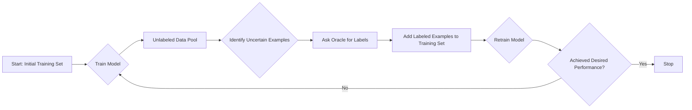
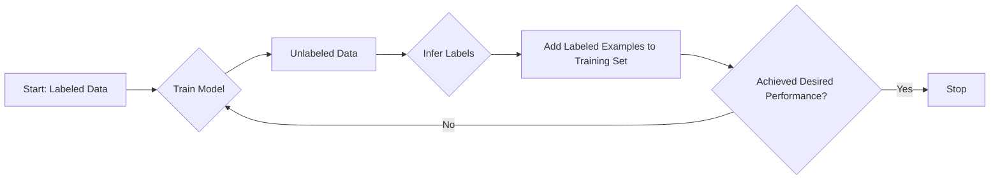

# ML

## Unsupervised learning
refers to the training of a model using unlabeled data, where the goal is to discover patterns or structure in the data without explicit supervision. Examples of unsupervised learning algorithms in computer vision include clustering methods like k-means or self-organizing maps.

## Semi-supervised learning

Semi-supervised learning, involves training a model using a combination of labeled and unlabeled data. The labeled data provides explicit supervision to guide the learning process, while the unlabeled data helps to leverage additional information or improve generalization. Semi-supervised learning methods are particularly useful when labeled data is scarce or expensive to obtain.

### Challenges
1. **Quality of unlabeled data:**   The quality of the unlabeled data can have a significant impact on the performance of the model. If the unlabeled data is noisy or contains irrelevant information, it can negatively affect the model's ability to generalize.

2. **Bias:**   Semi-supervised learning can be susceptible to bias if the labeled data is not representative of the entire population. This can lead to overfitting on the labeled data and poor generalization to new, unseen examples.

3. **Selection bias:**   The process of selecting which examples to label can introduce bias if the selection criteria are not carefully chosen. For example, if the selection criteria are based on the model's current performance, the model may become biased towards certain types of examples.

4. **Labeling cost:**   Although semi-supervised learning can reduce the overall labeling effort required, labeling can still be expensive and time-consuming. This can limit the amount of labeled data that is available and affect the performance of the model.

## Active learning 
Active learning is a specific approach within the realm of semi-supervised learning. It involves an iterative process where a learning algorithm actively selects the most informative instances from the unlabeled data pool and requests their labels from an oracle (such as a human annotator). The goal is to strategically choose the instances that are expected to contribute the most to the model's learning and performance, reducing the overall labeling effort required.

### Active Learning Strategies
1. **Uncertainty sampling:**   This strategy selects examples that the model is most uncertain about. For example, if the model outputs a probability distribution over classes, uncertainty sampling would select examples where the predicted probabilities are close to 0.5.
2. **Query-by-committee:** This strategy involves training multiple models with different initializations or architectures, and selecting examples where the models disagree the most. The idea is that if the models disagree, the example is likely to be difficult to classify and therefore informative.
2. **Diversity sampling:**  This strategy selects examples that are dissimilar to the examples already in the training set. This can help to ensure that the training set covers a wide range of the input space.
3. **Active learning with deep networks:**   This strategy involves using the activations of the hidden layers in a deep neural network to measure the informativeness of an example. The idea is that examples that activate the neurons in the hidden layers in a novel way are likely to be informative.

### More strategies for segmentation strategies

1. **Boundary sampling:**   This strategy selects examples that are near the boundaries of the segmented regions. The idea is that these examples are likely to be more informative because they are more difficult to segment accurately.

2. **Cluster-based sampling:**   This strategy selects examples that are representative of the different clusters of pixels in the image. The idea is that these examples are likely to be more informative because they capture the diversity of the image.

3. **Region-based sampling:**   This strategy selects examples that are representative of the different regions in the image. The idea is that these examples are likely to be more informative because they capture the different objects or structures in the image.

4. **Active learning with shape priors:**   This strategy involves using shape priors to guide the selection of informative examples. The idea is to use prior knowledge about the shapes of objects in the image to select examples that are likely to improve the model's performance.

Therefore, active learning combines elements of both supervised learning (using labeled data) and unsupervised learning (leveraging unlabeled data), making it a form of semi-supervised learning in the context of computer vision.

reinforcemnt learning with human feedback

Secondary taks:
shuffle tiles and try to rearange data. idea of connectivity